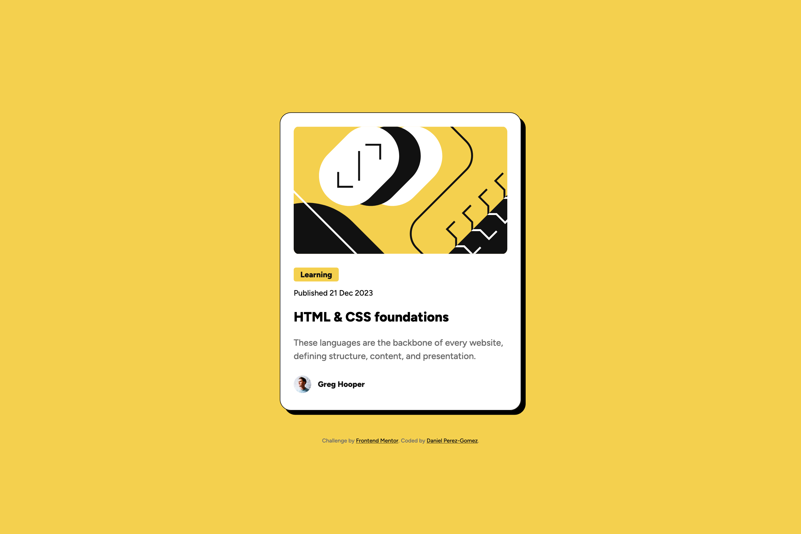
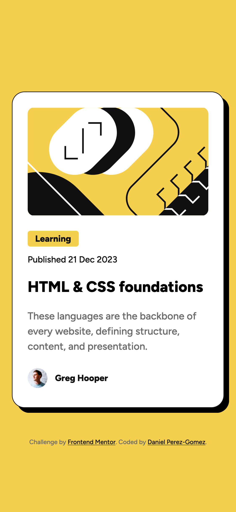

# Frontend Mentor - Blog preview card solution

This is my solution to the [Blog preview card challenge on Frontend Mentor](https://www.frontendmentor.io/challenges/blog-preview-card-ckPaj01IcS). Frontend Mentor challenges help you improve your coding skills by building realistic projects.

## Table of contents

- [Frontend Mentor - Blog preview card solution](#frontend-mentor---blog-preview-card-solution)
  - [Table of contents](#table-of-contents)
  - [Overview](#overview)
    - [The challenge](#the-challenge)
    - [Screenshots](#screenshots)
    - [Links](#links)
  - [My process](#my-process)
    - [Built with](#built-with)
    - [What I learned](#what-i-learned)
    - [Continued development](#continued-development)
    - [Useful resources](#useful-resources)
  - [Author](#author)

## Overview

### The challenge

Users should be able to:

- See hover and focus states for all interactive elements on the page

### Screenshots

  <div style="display: flex; flex-wrap: wrap; justify-content: center">
    
  </div>

### Links

- Solution URL: [Add solution URL here](https://github.com/danpgomez/blog-preview-card-main)
- Live Site URL: [Add live site URL here](https://your-live-site-url.com)

## My process

### Built with

- Semantic HTML5 markup
- CSS custom properties
- Flexbox
- Responsive design workflow

### What I learned

This was an awesome challenge as it helped me further improve building with accessibility and usability in mind. I focused on using semantic markup an styling using relative units to create a better user experience on all devices. A few highlights from what I learned are:

1. Using the `<time>` element for the publication date to allow for better SEO:

```html
<div class="publish-date">
  Published <time datetime="2023-12-21">21 Dec 2023</time>
</div>
```

2. Setting `rem` units using CSS properties:

```css
:root {
  --24px: 1.5rem;
}

.course-title {
    font-family: 'Figtree-ExtraBold';
    font-size: var(--24px);
}
```

### Continued development

- [ ] Improve user's ability to navigate via keyboard

### Useful resources

- [Chasing the Pixel-Perfect Dream](https://www.joshwcomeau.com/css/pixel-perfection/) - Amazing article by Josh Comeau full of tips on pixel-perfect implementation.

## Author

- Website - [Daniel Perez-Gomez](https://www.danpgomez.com)
- Frontend Mentor - [@danpgomez](https://www.frontendmentor.io/profile/danpgomez)
- Bluesky - [@danieltalkscode.com](https://bsky.app/profile/danieltalkscode.com)
